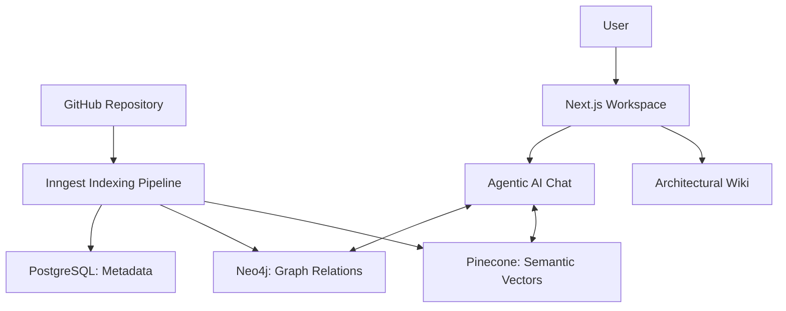

#  Code Atlas

**Code Atlas** is a next-generation AI agent for codebase exploration. It maps your repository's mental model into a high-performance **Graph-Native Knowledge Base**, allowing you to chat with your code, visualize complex architectural relationships, and search for logic semantically.

## 🚀 Overview



## ✨ Features

- **🧠 Multi-Modal Analysis**: Extracts structural, semantic, and architectural insights from raw source code.
- **🕸️ Graph-Native Architecture**: Maps imports, exports, and function calls into **Neo4j**, enabling complex dependency analysis.
- **🔍 Semantic Search**: Powered by **Pinecone** and Cloudflare's **BGE-M3** embeddings, find _functionality_ instead of just _keywords_.
- **⚡ Real-time Indexing**: Background processing via **Inngest** with live status updates delivered via SSE.
- **💬 Agentic Chat**: A research-driven chat assistant that autonomously explores your files to answer architecture questions.

---

## 🛠️ Tech Stack

- **Framework**: Next.js 15 (App Router)
- **Package Manager**: PNPM
- **Databases**:
  - **PostgreSQL**: User data & session management.
  - **Neo4j**: Graph-native codebase mapping.
  - **Pinecone**: Vector storage for semantic RAG.
- **Orchestration**: Inngest for reliable background workflows.
- **Auth**: Better Auth (GitHub OAuth).
- **Styling**: Tailwind CSS + Shadcn UI.

---

## 🏁 Getting Started

### 1. Prerequisites

- Docker (for local Neo4j/Postgres)
- Node.js (v20+)
- **PNPM** (required)
- API Keys: Pinecone, Resend, Gemini/Google AI.

### 2. Setup

```bash
# Clone the repository
git clone https://github.com/lwshakib/code-atlas.git
cd code-atlas

# Install dependencies
pnpm install

# Environment variables
cp .env.example .env
# Fill in your .env with the required keys

# Start infrastructure
docker-compose up -d

# Initialize Database
pnpm run db:migrate

# Start development server
pnpm run dev
```

Open [http://localhost:3000](http://localhost:3000) to begin mapping your first repository.

---

## 📂 Project Structure

- `/app`: Next.js 15 App Router (Pages, API routes).
- `/components`: UI kit including WebGL Background and AI components.
- `/inngest`: Background logic for GitHub ingestion and indexing.
- `/lib`: Database client initializers and shared utilities.
- `/llm`: Embedding generation and agentic streaming logic.

---

## 🤝 Contributing

We welcome contributions! Please see our [Contributing Guide](CONTRIBUTING.md) and [Code of Conduct](CODE_OF_CONDUCT.md).

## 📄 License

This project is licensed under the [MIT License](LICENSE).
