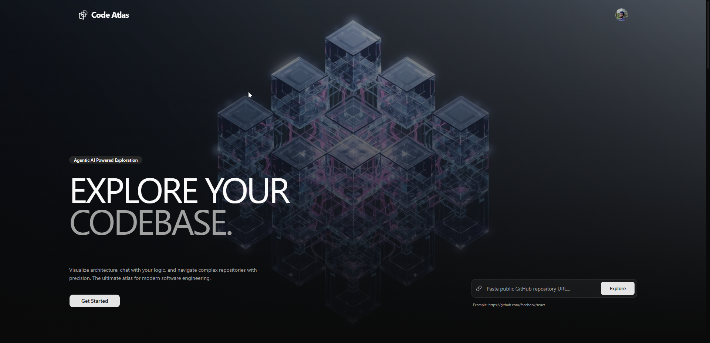
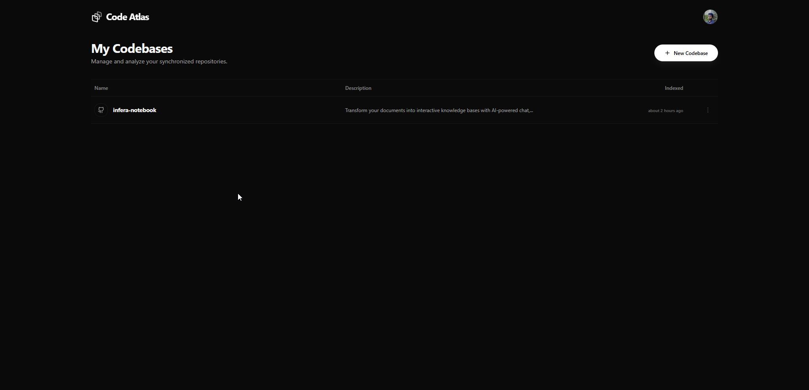
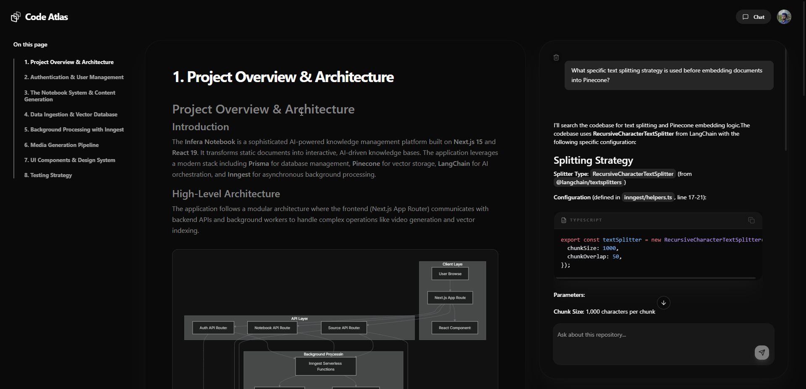

#  Code Atlas

**Code Atlas** is a next-generation AI agent for codebase exploration. It maps your repository's mental model into a high-performance **Graph-Native Knowledge Base**, allowing you to chat with your code, visualize complex architectural relationships, and search for logic semantically.

## 🚀 Features

- **🧠 Multi-Modal Analysis**: Uses advanced LLMs to extract structural, semantic, and architectural insights from raw source code.

- **🕸️ Graph-Native Architecture**: Maps imports, exports, and function calls into **Neo4j**, enabling complex dependency analysis and visual maps.
- **🔍 Semantic Search**: Powered by **Pinecone** and Cloudflare's **BGE-M3** embeddings, find *functionality* instead of just *keywords*.
- **⚡ Real-time Indexing**: Background processing via **Inngest** with live status updates delivered through server-side events.
- **💬 Agentic Chat**: A research-driven chat assistant that autonomously explores your files to answer difficult architecture questions.

---

## 🖼️ App Demo

| Landing Page | Dashboard | Code Exploration |
| :---: | :---: | :---: |
|  |  |  |

---

## 🛠️ Stack


- **Framework**: [Next.js 15 (App Router)](https://nextjs.org/)
- **Databases**: 
  - [**PostgreSQL (Prisma)**](https://www.prisma.io/): Persistent user data & session management.
  - [**Neo4j**](https://neo4j.com/): Graph representation of the codebase.
  - [**Pinecone**](https://www.pinecone.io/): Vector storage for semantic RAG.
- **Orchestration**: [**Inngest**](https://www.inngest.com/) for reliable background workflows & real-time events.
- **Auth**: [**Better Auth**](https://www.better-auth.com/) (GitHub OAuth integration).
- **Styling**: [**Tailwind CSS**](https://tailwindcss.com/) + [**Shadcn UI**](https://ui.shadcn.com/).

---

## 🏁 Getting Started

### 1. Clone the Repository
```bash
git clone https://github.com/lwshakib/code-atlas.git
cd code-atlas
```

### 2. Prerequisites

- Docker (for local Neo4j/Postgres)
- Node.js & Bun (recommended package manager)
- API Keys for: Pinecone, Resend, and your chosen LLM provider.

### 2. Environment Setup
Copy the example environment file and fill in your credentials:
```bash
cp .env.example .env
```

### 3. Install Dependencies
```bash
bun install
```

### 4. Start Infrastructure
```bash
docker-compose up -d
```

### 5. Run Development Server
```bash
bun dev
```

Open [http://localhost:3000](http://localhost:3000) to begin mapping your first repository.

---

## 📂 Project Structure

- `/app`: Next.js 15 App Router (Pages, API routes).
- `/components`: UI kit including the WebGL Background and Codebase components.
- `/inngest`: Background function logic for GitHub ingestion and indexing.
- `/lib`: Database client initializers (Neon, Pinecone, Neo4j).
- `/llm`: Embedding generation and agentic streaming logic.

---

## 🤝 Contributing

We welcome contributions! Please see our [Contributing Guide](CONTRIBUTING.md) and [Code of Conduct](CODE_OF_CONDUCT.md).

## 📄 License

This project is licensed under the [MIT License](LICENSE).

